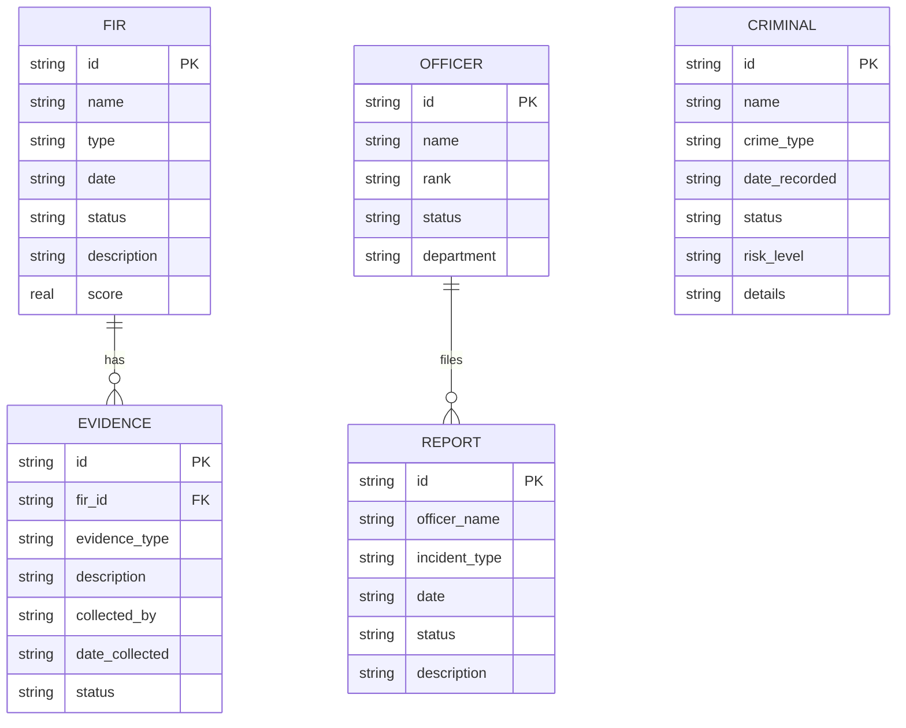

# Entity-Relationship Diagram for Police Station Management System

This ER diagram represents the database schema for the police station management system. It includes the main entities (tables) and their relationships based on the SQLite database schema.

## Explanation
- **FIR (First Information Report)**: Represents crime reports filed by victims/complainants.
- **Criminal**: Records of known criminals and their details.
- **Report**: Internal reports filed by officers (e.g., equipment issues, complaints).
- **Officer**: Police officers and their information.
- **Evidence**: Evidence collected for FIRs, linked via `fir_id`.

### Relationships
- A FIR can have multiple pieces of evidence (one-to-many).
- An Officer can file multiple reports (one-to-many, based on `officer_name` field).

Note: Some relationships are logical/inferred from field names, as not all are enforced via foreign keys in the current schema. The Criminal entity is standalone with no direct relationships shown.
